# 🚴 Análise de Proximidade de Ciclovias - Baixada Santista

 *Mapa gerado pelo projeto*  
  
*Santos, São Vicente*

Análise geoespacial para identificar pontos de interesse (POIs) distantes da rede cicloviária na região da Baixada Santista, SP.

## 🎯 Objetivo Ampliado

### Diagnóstico Espacial
Identificar **áreas críticas** com deficit de infraestrutura cicloviária através de análise geoespacial integrada:

```mermaid
graph TD
    A[Malha Cicloviária] --> B{Análise de Proximidade}
    C[Pontos de Interesse] --> B
    D[Vias Urbanas] --> B
    B --> E[Mapa de Calor de Deficits]
    E --> F[Priorização de Intervenções]
```


## 🌱 Histórico e Importância

### Origem Acadêmica
Este estudo nasceu como trabalho na **FATEC Baixada Santista**, desenvolvido inicialmente para a disciplina de:
- Projeto Integrador III

### Evolução do Projeto
```diff
# Versão Inicial (Trabalho em Grupo)
- Análise básica de proximidade
- Visualizações estáticas
- Dados limitados a 3 categorias de POIs

# Versão Atual (Desenvolvimento Individual)
+ Algoritmos otimizados
+ Mapas interativos com Folium
+ Expansão para 8 categorias de POIs
+ Metodologia reprodutível
```

## 🛠️ Tecnologias Utilizadas


```mermaid
graph TD
    A[Dados Geográficos] --> B{Processamento}
    B --> C[Análise de Distâncias]
    B --> D[Visualização]
    C --> E[POIs Distantes]
    D --> F[Mapa Interativo]
